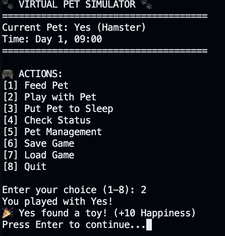

# 🐾 Virtual Pet Simulator
***

A text‑based virtual pet game built in Python for the CS 1400 Classes Project.  
This simulator demonstrates object‑oriented programming, class interactions, game logic, random events, and data persistence.  
Players can create multiple pets, care for them, manage their stats, and watch them grow over time.

---

## 🕹️ How to Use
***
1. Download or clone the repository.
2. Open the project in GitHub Codespaces, VS Code, or any Python environment.
3. Run the main program:
   main.py
   After opening the src folder. 

4. Follow the on‑screen menu to:
   - Create pets  
   - Feed, play, and care for them  
   - Switch between multiple pets  
   - Save and load your game  
5. No external libraries are required — everything uses standard Python.

---

## ✨ Project Features
***

### 🐶 **Pet Class System**
- Create pets with name, species, age, level, and skills  
- Dynamic stats: **health**, **hunger**, **happiness**, **energy**  
- Methods for feeding, playing, sleeping, and checking status  

### ⏰ **Time System**
- Every action advances the in‑game clock  
- Tracks days and hours  

### 🍎 **Food System**
- Multiple food types  
- Each affects hunger and happiness differently  

### 🎮 **Gameplay Interactions**
- Actions influence multiple stats at once  
- Pets can level up and learn new skills  
- Health changes based on care quality  

### 🎲 **Random Events**
- Pets may get sick  
- Pets may find toys  
- Happiness and health can change unexpectedly  

### 🐕 **Pet Management**
- Create unlimited pets  
- Switch active pets  
- Release pets permanently  

### 💾 **Save & Load System**
- Saves all pets and game time to a JSON file  
- Load your progress at any time  

### 🧹 **Error Handling**
- Input validation for all menus  
- Graceful handling of invalid entries  

---

## 🛠️ Installation Instructions
***
This class does not require packaging into an executable.  
If a `.exe` or standalone build is created later, installation steps would go here.

---

## 📜 License
***
This project was created for school and has no copyright.

---

## 👥 Contributors
- *Your GitHub username here*
- *(Add any group members if applicable)*

---

## 🤝 Contribute
***
Not used for this class.  
In a real open‑source project, this section would explain how to submit changes or pull requests.
